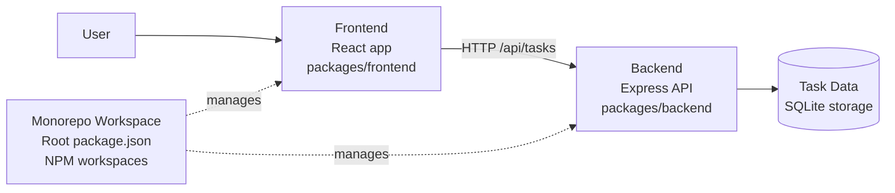
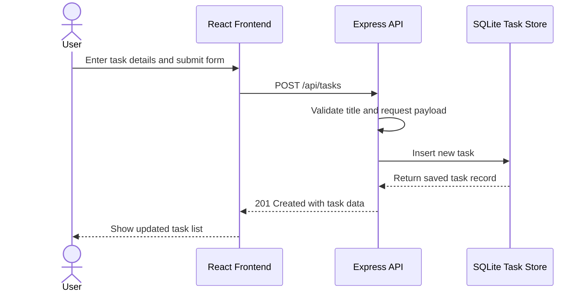

# Cloud Architecture Overview

This monorepo contains a React frontend and a Node.js backend managed from a single workspace. The frontend is the user-facing application, and it communicates with the backend over HTTP for task operations.

## Create TODO Sequence

## Components

- Frontend: React application in `packages/frontend`
- Backend: Express API in `packages/backend`
- Data store: SQLite-backed task storage owned by the backend
- Monorepo orchestration: root workspace scripts in `package.json`